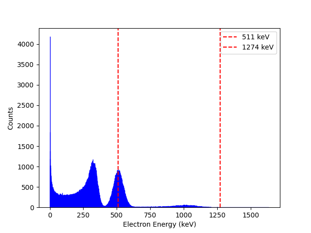

# Na-22 Gamma Emission Simulation

This repository contains code to simulate the gamma-ray emission from a sodium-22 (Na-22) source. The simulation includes:

- Pair annihilation and the production of 511 keV photons.
- Gamma emission at 1274 keV.
- Effects of Compton scattering and the photoelectric effect.

It's not include the pair production effect.

## Features

- **Spectrum Simulation**: Simulates the energy spectrum of gamma rays emitted from a Na-22 source.
- **Physics Processes**: Includes Compton scattering, photoelectric effects, and annihilation photons. 
- **Detector Response**: Models detector resolution. 

## Example Output

Below is an example of the simulated gamma-ray spectrum from a Na-22 source:

The red dashed lines indicate the primary gamma emissions at **511 keV** and **1274 keV**.

